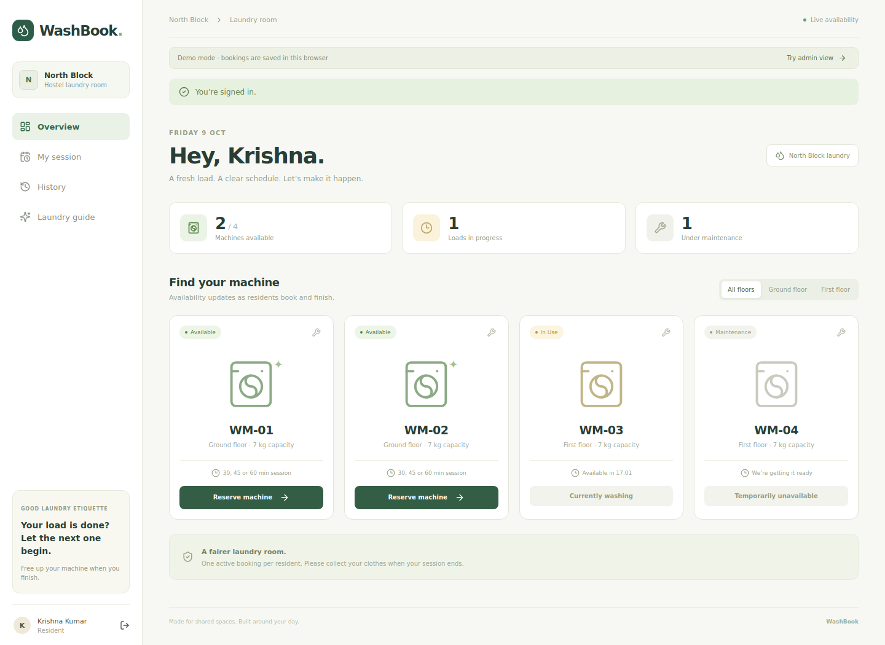
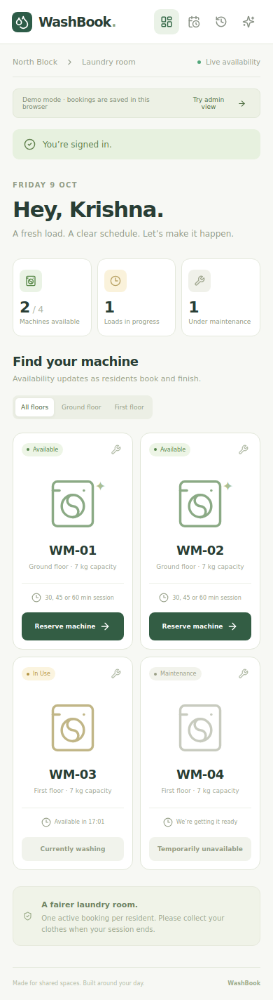
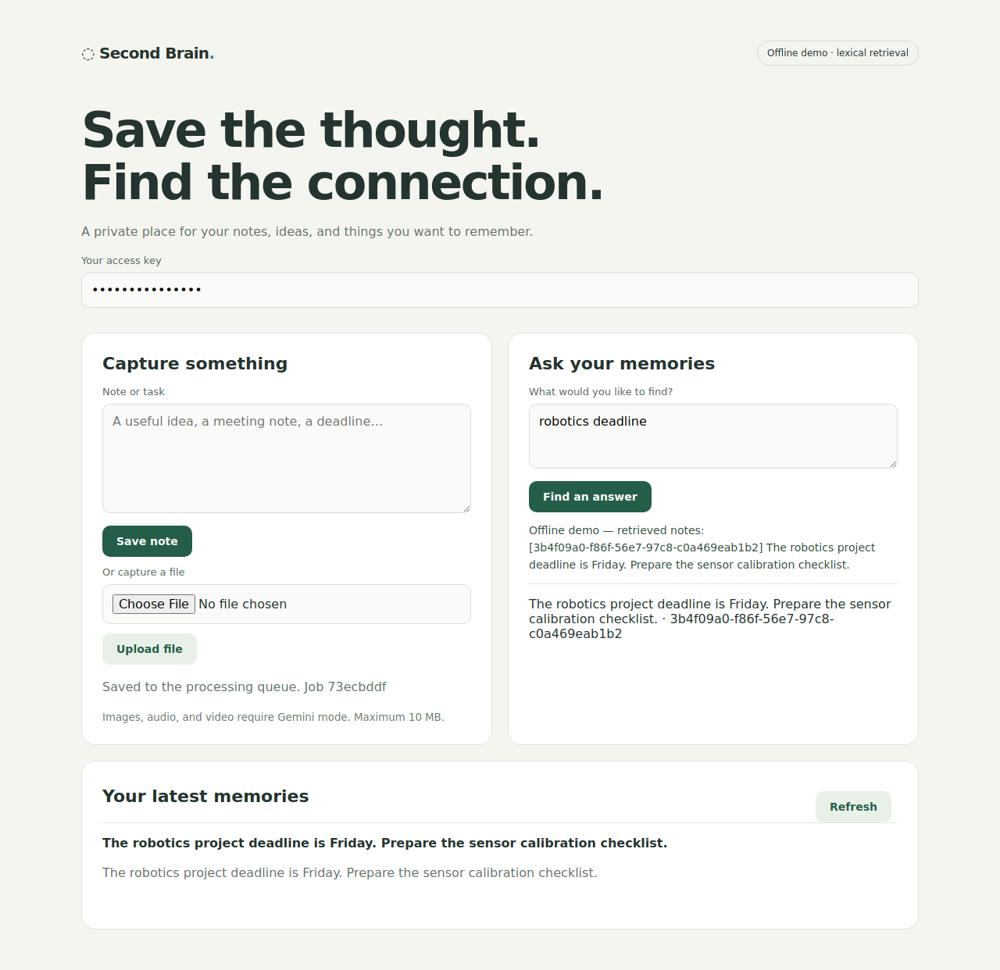

# Validation record

Checks performed on 9 October 2026.

| Check | Result | What was exercised |
| --- | --- | --- |
| Distributed rate limiter | 6 tests passed with a real Redis 7.4.2 server; also passed with fakeredis/Lua | Concurrent requests across eight bucket instances, capacity enforcement, tenant isolation, expiry, refill, script-cache recovery, HTTP authentication, rejection headers, metrics protection, and Redis failure handling |
| AI Second Brain | 9 tests passed | SQLite job claims and lease recovery, owner isolation, capture idempotency, partial index failure and retry, citation validation, HTTP access and upload limits, Telegram webhook boundaries, mocked Gemini media requests, and restart persistence with real local SQLite/Qdrant |
| WashBook domain | 3 tests passed | Input validation, authorization, and reservation timing boundaries |
| WashBook Firestore integration and rules | 14 tests passed against local Firestore/Auth emulators | Simultaneous machine/user claims, stale extensions, expired reservation replacement, idempotent retries, owner/admin access, audited maintenance, private reports, cleanup races, missing-session reconciliation, and denial of unauthorized client writes/reads |
| WashBook callable HTTP integration | 2 tests passed | Firebase web SDK anonymous authentication, booking/extension/completion through the exported HTTPS handlers, persisted changes, and rejection of an unauthenticated caller |
| Python static checks | Both projects passed Ruff | Enabled lint rules in each project's configuration |
| WashBook production build | Passed TypeScript checks and Vite build, including Firebase mode | Production compilation of the UI and dynamically loaded Firebase gateway |
| Browser walkthroughs | Passed in headless Chrome 134 | WashBook demo reserve/extend/finish, history, admin maintenance, and 390px mobile layout; Second Brain text capture, background processing, retrieval, and citations; no page errors during the walkthroughs |

There are **34 distinct automated tests**. Python dependencies were installed from each project's frozen `uv.lock`, and Node dependencies are recorded in `package-lock.json`. CI runs the Python suites with a Redis service, the Firebase-backed tests, and the React production build.

The callable integration test mounts the actual exported Firebase `onCall` HTTPS functions on a local TCP port using Express. The functions verify real emulator-issued ID tokens through the Admin SDK. The standard Functions emulator loaded the exports, but its Unix-socket runtime transport could not run requests in this workspace; the TCP test avoids that transport without disabling authentication. Interactive development still uses the standard `npm run emulators` command.

## Live integrations and remaining checks

- Gemini requests are validated with mocked HTTP transport. Actual Gemini generation/embeddings and Telegram/Notion accounts require your credentials and have not been exercised against live accounts.
- WashBook's shared backend is tested locally. Live Google sign-in, scheduled Cloud Functions execution, and Firebase deployment require a configured Firebase project.
- Docker Compose, Prometheus, and Grafana configuration was parsed and inspected. A Docker daemon was unavailable here, so the complete container stacks and live dashboards have not been started.
- Vite reports a size warning for the Firebase SDK chunk in Firebase mode. The gateway is loaded dynamically; the browser demo uses the smaller application bundle.

## Screenshots from the browser checks

### WashBook desktop

### WashBook mobile

### Second Brain

